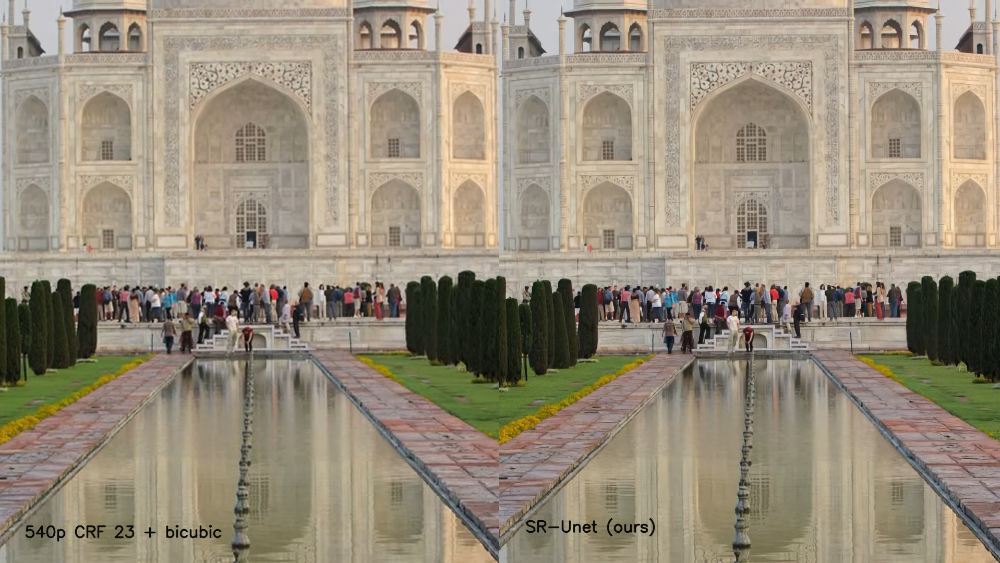

# SRV-UNet

This repository contains the implementation of [1]. It is an architecture comprised with a GAN-based training procedure
for obtaining a fast neural network which enable better bitrate performances respect to the H.265 codec for the same
quality, or better quality at the same bitrate.

## Requirements

- Installing requirements: `$ pip install -r requirements.txt`
- [VMAF Pytorch](https://github.com/alvitrioliks/VMAF-torch): Follow the instructions in the repository to install the VMAF
  metric for PyTorch.
- FFMpeg compiled with H.265 codec and also VMAF metric. For references
  check [the official compilation guide](https://trac.ffmpeg.org/wiki/CompilationGuide/Ubuntu).
- [VMAF GitHub Repository](https://github.com/Netflix/vmaf).
- [LPIPS](https://github.com/richzhang/PerceptualSimilarity): For the original implementation of [1].

## Dataset

The dataset used for training is the [BVI-DVC](https://arxiv.org/pdf/2003.13552). For preparing the dataset
there are two helper script,
`compress_train_videos.sh` for spatially compressing and encoding each video, then with `extract_train_frames.sh` the
dataset can be prepared. The train dataset should follow this naming scheme (assuming the videos are encoded with CRF 22):

```bash
  [DATASET_DIR]/
      frames_HQ/
          [clipName1]/
              [clipName1]_001.png
              [clipName1]_002.png
              ...
              [clipName1]_064.png
          [clipName2]/
              ...
          [clipNameN]/
              ...
      frames_CRF_22/
          [clipName1]/
              [clipName1]_001.png
              [clipName1]_002.png
              ...
              [clipName1]_064.png
          [clipName2]/
              ...
          [clipNameN]/
              ...
```

## Training

To train the model for 2x Super Resolution (as used in the model for the 540p -> 1080p
upscaling), you can use this command.

```bash
$ python train.py --arch srunet --device 0 --upscale 2 --export [EXPORT_DIR] \
--epochs 8 --dataset [DATASET_DIR] --crf 22
```

Or, since most of these arguments are defaults, simply

```bash
$ python train.py --dataset [DATASET_DIR]
```

For more information about the other parameters, inspect `utils.py` or try

```bash
& python train.py -h
```

However, in the bandwidth experiments we employed a lighter model, trained on a range of CRFs for performing an easier
1.5x upscale (720p -> 1080p). It is obtainable with the following command:

```bash
$ python train.py --arch srunet --layer_multiplier 0.7 --n_filters 48 --downsample 0.75 --device 0 \
--upscale 2 --export [EXPORT_DIR] --epochs 80 --dataset [DATASET_DIR] --crf [CRF]
```

## Testing

We tested on the 1080p clips available from the [Derf's Collection](https://media.xiph.org/video/derf/) in Y4M format. 
For preparing the test set (of encoded clips) you can use the `compress_test_videos.sh` helper script.
The test set will be structured as follows, and there is no need of extracting each frame:

```bash
    [TEST_DIR]/
        encoded540CRF23/
            aspen_1080p.mp4
            crowd_run_1080p50.mp4
            ducks_take_off_1080p50.mp4
            ...
            touchdown_pass_1080p.mp4
        aspen_1080p.y4m
        crowd_run_1080p50.y4m
        ducks_take_off_1080p50.y4m
        ...
        touchdown_pass_1080p.y4m
```

For testing the model (e.g. the one performing 1.5x upscale) which checkpoints are saved in _[MODEL_NAME]_, you can use
the following command:

```bash
$ python evaluate_model.py --model [MODEL_NAME] --arch srunet --layer_mult 0.7 --n_filters 48 \
--downsample 0.75 --device 0 --upscale 2 --crf 23 --test_dir [TEST_DIR] --testinputres 720 --testoutputres 1080
```

Ultimately will be printed on screen the experimental results, and also will be saved a .csv file contained these infos.

## Inference

You can use the script `render.py` for using the model in real-time to upscale your clips. Examples:

- For 2x upscaling

    ```bash
    $ python render.py --clipname path/to/clip.mp4 --model models/srunet_2x_crf23.pth
    ```

- For 1.5x upscaling

    ```bash
    $ python render.py --clipname path/to/clip.mp4 --model models/srunet_1.5x_crf23.pth \
    --layer_mult 0.7 --n_filters 48 --downsample 0.75
    ```

By default the output is split in two halves: on the left there is the input, on the right there is
the upscaled version. You can show only the upscaled version by adding the flag `--show-only-upscaled`.

About performances, a GTX 1080 Ti is enough for rendering at 30fps when upscaling 540p -> 1080p and 25fps when 720p ->
1080p. Note that in the paper we also employed [Nvidia Apex](https://nvidia.github.io/apex/) for speeding up inference
times.

## Examples


Check [this link](https://bit.ly/3aGPzMW) for the complete clip.  


## References

This code is the implementation of my Master Degree Thesis, from which my supervisors and I wrote the paper:

- [1] Fast video visual quality and resolution improvement using SR-UNet. Authors Federico Vaccaro, Marco Bertini,
  Tiberio Uricchio, and Alberto Del Bimbo (accepted at ACM MM '21).
  